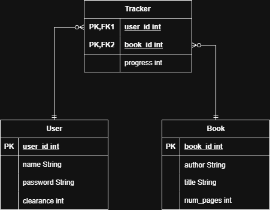
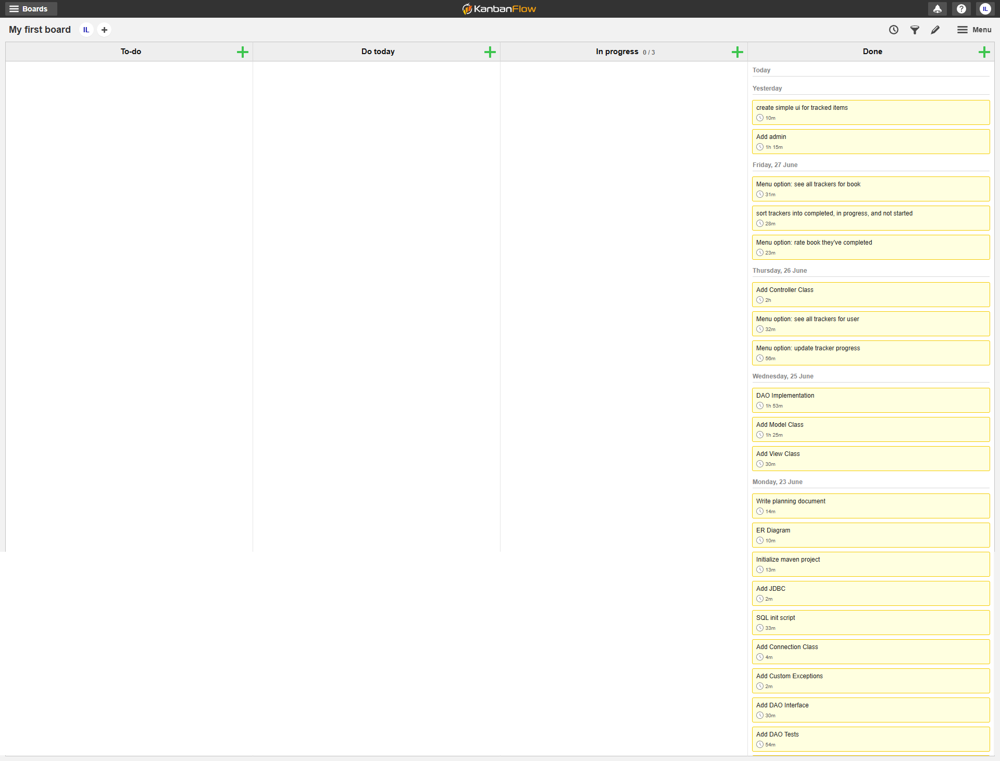

# Cognixia Capstone Project

An MVC Java CLI program that uses JDBC via a DAO to connect to a MySQL server to track users progress on different books.

## How to use:

1. Prerequisites: `JDK`, `MySql`, make sure MySQL server is running
2. Use `tracker_db.sql` to create and populate the MySQL server database
3. Configure `ConnectionManager.java` to connect to your port, with the correct username and password
4. Compile & Run the main method in `App.java` to start the application, or run `mvn compile` to compile, then `mvn exec:java` to run it

## Usage Information

`tracker_db.sql` populates the database with test users, books, and 
trackers for each of those users, the user names and passwords are (in the format `username` `password`): 

- testuser1 password1
- testuser2 password2
- testuser3 password3
- testuser4 password4
- testuser5 password5
- admin admin

Logging in as admin will show the admin menu, which allows the user to add, 
remove, and update books in the database.

## ER Diagram

## Kanban Board:

https://kanbanflow.com/board/9E6Qdto

The kanban board:

The time log is located at `./kanban_time_tracker.pdf`

## Requirements:

- [x] Console based menu
  - [x] Users can update trackers
  - [x] Users can view trackers
- [x] At least 2 tables (User and topic for tracking)
- [x] Users login with username and password
- [x] Each user's tracker has not completed, in progress, and not started
- [x] Users can only make changes to their individual trackers
- [x] Data stored in MySQL database
- [x] ER Diagram included in repository
- [x] SQL script that creates database and sample data
- [x] Uses JDBC and DAO to connect Java to SQL backend
- [x] Project tracked with git, agile principles, and kanban board
- [x] At least 2 custom exceptions
- [x] At least 10 options to track
- [x] Create as a Maven project
- [x] In progress items should show how far along you are
- [x] Admin can add, remove, and change topic information
- [x] Users can view tracker reports for topic as a whole
- [x] Have option to create account if user does not have one
- [x] Have option to rate option
- [x] Have way to show average rating across all users for one topic
- [x] Create simple UI to show the status of a user's tracked items

## My own additions:

- MVC Architecture
- Unit testing for the DAO implementation
- Mimics server communication by converting data to JSON format and uses Request/Response objects

## Next Steps:

Next steps for this project could involve...

- Hosting the backend (DAO) on a Java server (AWS)
- Hosting the database online
- Hosting the Controller + View on a Web GUI frontend

Some ideas for next steps in terms of technologies...

- Amazon EC2 for the Java server, using Spring and Hibernate with API Endpoints
- CockroachDB for the hosted SQL server (because it has a free tier)
- React frontend hosted on Amplify
